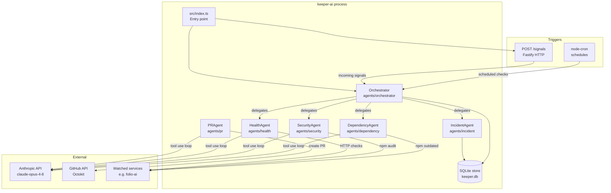

# CLAUDE.md — keeper-ai Project Context

> Read this at the start of every session before taking any action.

---

## What keeper-ai Is

**keeper-ai** is a multi-agent system for day-2 operations automation. It watches configured
services and handles health monitoring, tech currency, security patching, and incident management.
Proposed changes are delivered as GitHub Pull Requests (HITL today, HotL as the end goal).

**First managed service:** folio-ai (`creativecloudnative/folio-ai`) — a Next.js portfolio site
on Vercel. Source at `~/dev/folio-ai`. Read `~/dev/folio-ai/CLAUDE.md` before touching it.

---

## Architecture



### Agent Roles

| Agent | Trigger | What It Does |
|---|---|---|
| **Orchestrator** | cron / signals | Routes work to specialists; tracks runs in SQLite |
| **DependencyAgent** | weekly cron | Clones repo, runs `npm outdated`, recommends PR |
| **SecurityAgent** | daily cron | Clones repo, runs `npm audit`, recommends PR above threshold |
| **HealthAgent** | every 6h cron | HTTP-checks configured endpoints, recommends incident |
| **IncidentAgent** | called by Orchestrator | Manages incident lifecycle in SQLite (no LLM) |
| **PRAgent** | called after agent recommends PR | Creates GitHub PR with structured body |

### Agentic Loop (all specialist agents)

Each specialist uses `src/agents/base.ts:runAgentLoop()` — a manual tool-use loop:

1. Send system prompt + user message to `claude-opus-4-8` with `thinking: {type: 'adaptive'}`
2. If `stop_reason === 'tool_use'`: execute tool(s), append results, loop
3. If `stop_reason === 'end_turn'`: extract text summary, return `AgentResult`
4. Guard: max 20 iterations before failing with `max_iterations_exceeded`

---

## Tech Stack

| Concern | Choice | Why |
|---|---|---|
| Language | TypeScript + Node.js | Consistent with folio-ai; strong Anthropic SDK support |
| Agent SDK | `@anthropic-ai/sdk` | Direct API control; we host compute; HITL gates require custom loop |
| Model | `claude-opus-4-8` | Best reasoning for autonomous ops decisions |
| HTTP server | Fastify | Lightweight, TypeScript-first, for signal ingestion webhook |
| Scheduler | `node-cron` | Simple, in-process cron without external dependencies |
| State | SQLite via `better-sqlite3` | File-based; no infra needed; WAL mode for concurrent reads |
| GitHub | `@octokit/rest` | PR creation, repo reads |
| Config | YAML via `js-yaml` + Zod | Human-readable service config with runtime validation |

---

## Project Structure

```
keeper-ai/
├── config/
│   └── services.yaml          # Managed services config (edit this to add services)
├── src/
│   ├── index.ts               # Entry point: starts Orchestrator + Fastify
│   ├── shared/
│   │   ├── types.ts           # AgentResult, Incident, Run domain types
│   │   ├── logger.ts          # Pino logger instance
│   │   └── github.ts          # Octokit singleton + parseRepo helper
│   ├── config/
│   │   ├── schema.ts          # Zod schemas for services.yaml
│   │   └── loader.ts          # Loads and validates config (cached singleton)
│   ├── store/
│   │   ├── schema.ts          # SQLite CREATE TABLE statements
│   │   └── index.ts           # store.{createIncident,startRun,completeRun,...}
│   ├── signals/
│   │   ├── types.ts           # Signal type definition
│   │   └── handlers.ts        # Fastify routes: POST /signals, GET /health
│   └── agents/
│       ├── base.ts            # runAgentLoop() — shared agentic loop
│       ├── orchestrator/
│       │   └── index.ts       # Orchestrator class (cron scheduling + signal routing)
│       ├── dependency/
│       │   ├── tools.ts       # read_package_json, check_npm_outdated
│       │   └── index.ts       # runDependencyAgent()
│       ├── security/
│       │   ├── tools.ts       # run_npm_audit
│       │   └── index.ts       # runSecurityAgent()
│       ├── health/
│       │   ├── tools.ts       # check_http_endpoint
│       │   └── index.ts       # runHealthAgent()
│       ├── incident/
│       │   └── index.ts       # createIncident, resolveIncident (no LLM)
│       └── pr/
│           ├── tools.ts       # get_repo_info, create_pull_request
│           └── index.ts       # runPRAgent()
├── .env.example
├── package.json
└── tsconfig.json
```

---

## Running Locally

```bash
cp .env.example .env
# fill in ANTHROPIC_API_KEY and GITHUB_TOKEN

npm install
npm run dev          # tsx watch — hot reloads on save
npm run typecheck    # tsc --noEmit
npm run build        # compile to dist/
npm start            # run compiled output
```

The process starts the Orchestrator (registers cron schedules) and a Fastify server on port 3001.

**Trigger a manual check via signal:**
```bash
curl -X POST http://localhost:3001/signals \
  -H 'Content-Type: application/json' \
  -d '{"type":"manual.trigger","source":"curl","serviceId":"folio-ai"}'
```

---

## Adding a New Managed Service

1. Add an entry to `config/services.yaml` following the folio-ai template
2. The Orchestrator picks it up on next start — no code changes needed

---

## Adding a New Agent

1. Create `src/agents/<name>/tools.ts` — define `Anthropic.Tool[]` and a handler function
2. Create `src/agents/<name>/index.ts` — call `runAgentLoop()` with your tools and prompts
3. Wire it into `src/agents/orchestrator/index.ts`

---

## HITL → HotL Evolution

**Current state (HITL):** Agents analyze and recommend; a human reviews the PR before merge.
PRAgent creates the PR; no auto-merge. Incident creation is automatic but remediation is not.

**Future state (HotL):** High-confidence, low-risk actions (patch updates, minor version bumps)
auto-merge after passing CI. The `store.runs` table is the audit trail. The `pr.draft` flag
in service config is the first gate to toggle.

The `AgentResult.artifacts` field is reserved for structured output that future HotL logic
will act on (e.g., `{action: 'create_pr', branch: '...', confidence: 0.95}`).

---

## Conventions

- **Commits:** Conventional commits (`feat:`, `fix:`, `chore:`, `security:`)
- **Branching:** `main` is stable; feature branches per capability
- **Diagrams:** Mermaid (version-controlled)
- **No over-engineering:** Implement what's needed now; the HotL path is future scope

---

*Last updated: June 2026*
